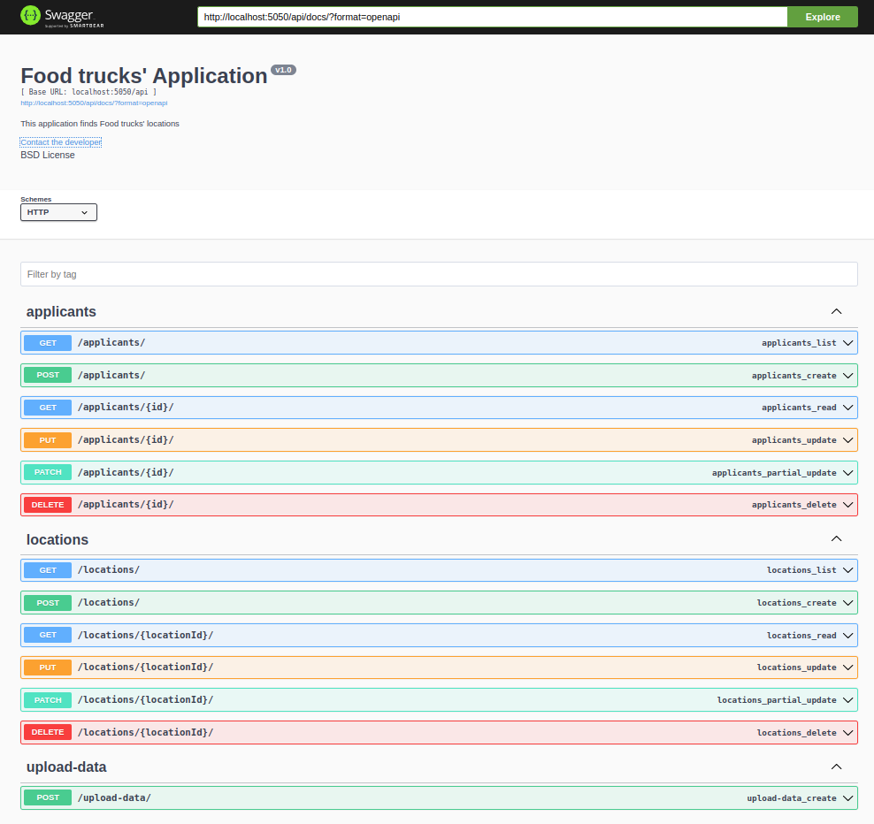
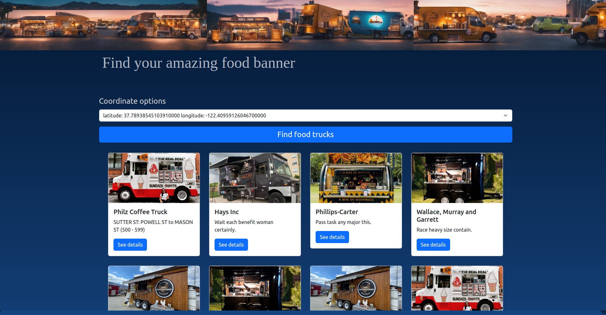

<div align="center"> 
	
</div>
<div align="center">    
    <h1 > Food trucks' application </h1>
</div>

<p align="center">
 <a href="#-About-this-project">About this project</a> •
 <a href="#-Technologies">Technologies</a> •
 <a href="#-Useful-CLI-commands">CLI commands</a> •
 <a href="#-Documentation">Documentation</a> •
 <a href="#-How-to-run-this-project">How to run</a> •
 <a href="#-Author">Author</a> • 
</p>

<div align="center">    
    
</div>

# Content

## 💻 About this project

🚀 This project has implemented both backend and frontend. The implemented logic relies mainly over two models, Locations and Applicants or Trucks models.
Each location can have several trucks. Therefore, at the frontend, an interface to filter trucks by locations is implemented.

## 🛠 Technologies

### 🧭 Backend: 
The backend is implemented using Rest Django. Therefore, it is written in Python.
In the Figure below, you can see the Swagger documentation. Note that from the point of view of backend, the trucks are considered as applicants.



### 🎨 Frontend:
The frontend is implemented using React and Typescript.
One of the amazing results that you can find with this application is shown in the Figure below.


In addition, if one day you get lost in my application, Bonnie always will help you to go back on the right track.


## ⚙️ Useful CLI commands

To populate the database with fake value, the following commands are provided

```bash
python manage.py fake_location <size_batch>
```

where the parameter `size_batch` represents the number of random locations that will be inserted into the database.

```bash
python manage.py fake_trucks <size_batch>
```

this parameter works similarly to the previous command. However, the user must consider a size_batch value at least 10 times the size_batch of the Location model. Thus, the probability of each location having several trucks is higher.


```bash
python manage.py fake_populate <size_batch>
```

this command populates the Locations and Applicants models by considering a size_batch relation of 1 to 10.

### CLI commands examples

```bash
python manage.py fake_location 100
python manage.py fake_trucks 1000
python manage.py fake_populate 200
```


## 📝 Documentation

The backend has CRUD endpoints for each model. Futhermore, an amazing service to upload data from a CSV file is implemented. For more details, please go to Swagger documentation in the following link:

```
http://localhost:5050/api/docs/
```

## How to run this app 

This application makes use of Python 3.11. Create a virtual environment of this Python version and install all packages specified in the file requirements.txt


### Option 1: Running in DEBUG True mode with the generated Database (Recommended)

Use the following command to run the backend

```bash
python manage.py runserver 0.0.0.0:5050
```
Then, follow the next steps, go to the folder "frontend" and use the npm commands to run the React application. You can follow the next commands to run the frontend


```bash
cd frontend
npm run dev
```

if you want to run this app with DEBUG = False, you have to take into account that you need to generate the static files for Django and also you have to compile the Typescript scripts to generate the Javascript files for React.

### Option 2: Running in DEBUG True mode and generate a new Database 

Follow the next steps

* Delete the db.sqlite3 file
* Create a new database by using the next commands

```bash
python manage.py makemigrations
python manage.py migrate
```
At this moment, you database is empty. You can populate it using the CLI commands. However, you can also use the data.csv file through the upload data service. See the api/docs endpoint of the backend for more details.


## 🦸 Author

<a href="https://www.linkedin.com/in/alvaro-javier-ortega-951241174/">
 
 <br />
 <sub><b>Alvaro Ortega</b></sub></a> <a href="https://www.linkedin.com/in/alvaro-javier-ortega-951241174/" >🚀</a>
 <br />

[](https://www.linkedin.com/in/alvaro-javier-ortega-951241174//)
[](mailto:alvarojavierortega.com@gmail.com)


